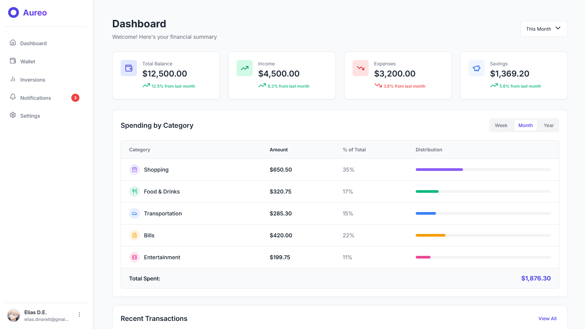

<div align="center">
  
  
  # Aureo - Finances Modern App
  
  [](https://angular.io/)
  [](https://www.typescriptlang.org/)

  A comprehensive platform for managing and tracking investments in financial markets.
</div>

## 📱 Preview



## 🚀 Key Features

- [ ] 📊 Investment dashboard with portfolio summary
- [ ] 📈 Real-time asset tracking
- [ ] 💹 Interactive performance charts
- [ ] 📱 Responsive design for all devices
- [ ] 🔔 Market notifications
- [ ] 📅 Built-in economic calendar

## 🛠️ Installation

1. Clone the repository:
   ```bash
   git clone https://github.com/your-username/aureo.git
   cd aureo
   ```

2. Install dependencies:
   ```bash
   npm install
   ```

3. Start the development server:
   ```bash
   ng serve
   ```

4. Open your browser at `http://localhost:4200/`

## 🚀 Deployment

To generate a production build:

```bash
ng build --configuration production
```

The compiled files will be stored in the `dist/` directory.

## 🏗️ Project Structure

```
src/
├── app/
│   ├── inversiones/         # Investment management module
│   ├── navbar/              # Navigation bar component
│   ├── services/            # Application services
│   └── ...
└── assets/                # Static assets
```

## Component Generation

Use Angular CLI to generate new components:

```bash
# Generate a new component
ng generate component component-name

# Generate a new service
ng generate service services/service-name
```

## Testing

Run unit tests:

```bash
ng test
```

For end-to-end tests:

```bash
ng e2e
```

## 🤝 Contributing

Contributions are welcome! Please read our [contribution guidelines](CONTRIBUTING.md) before submitting a pull request.

## 📄 License

This project is licensed under the MIT License - see the [LICENSE](LICENSE) file for details.

---

<div align="center">
  Made with ❤️ by Elias D.E.
</div>
